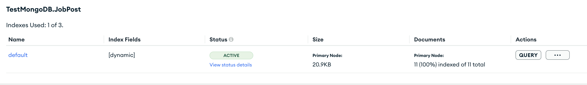

Notes on MongoDB 

# what is mongo db
> MongoDB is categorized as a "NoSQL" database

>"NoSQL" does not mean "no SQL" in the sense of not using any form of query language. Rather, it stands for "**Not Only SQL**" indicating that NoSQL databases do not exclusively rely on the traditional SQL-based relational model for data storage and retrieval.

> MongoDB uses a query language similar to SQL, called the MongoDB Query Language (MQL), to interact with its data and to persorf CRUD operations.

## SQL vs NoSQL database
> SQl is also called as relational and NoSQl can be referred as non-relational databases.

> The SQL database has the fixed schema(the schema is typically defined using tables, columns, data types, and relationships between tables) where as the NoSQL donot have fixed schema.

> lets understand with an example 
  --> Suppose I started a book store and I deliver books to the customers and my customer table contains name, address and mobile number.
	  If one of the customers want himself to be updated with the order details over email, we are supposed to add anoterh column meanwhile the another customer don't want to give his mobile number,

> IN the above scenarios if we use the SQL database the left over columsn with no data are filled with **null** which is a bit dangerous. 

> In the same scenario if we implant NoSQL it is not at all a problem as the data is represented in BSON. That particular customer contains an extra record that's it.

## Use cases of relational(SQL) and non relational(NoSQL) databases
> If we have to maintain multiple relationship between the tables **Ex:** If the customer buy 2-3 products at a time we don't store everything in the same table like in the image  instead we split the data accross multiple tables like in the next image . In the above cases SQL serves in a better way.

>Instagram has the database for users and list fo their posts  in this case NoSQL is the best choise because it is much easy to map the posts.

>As the final verdict the usage of relational(SQL) and non relational(NoSQL) databases depends on teh project.


## Swagger dependency

``` java
<dependency>
	<groupId>org.springdoc</groupId>
	<artifactId>springdoc-openapi-starter-webmvc-ui</artifactId>
	<version>2.0.0</version>
</dependency>
```

## The below line has to be added on the pojo class 
pojo is often referred as document because, a document in MongoDB is essentially a JSON-like structure that represents a piece of data.

In MongoDB, a collection is a grouping of MongoDB documents. It is the equivalent of a table in a relational database. Each collection
exists within a specific database and can hold a set of documents that represent related data.

``` java
@Document(collection = "JobPost");
```

To find the URI added in application.properties go to mongo atlas
login with mail id -> database-> under database click connect -> select drivers and URL will ge given
modify the URI having <password> with correct password(saikrishna).

> The hierarchy is as follows: within a MongoDB cluster, you can have multiple databases, each database can contain multiple collections, and each collection holds individual documents.

## Collection vs Document
> Collection is a group of mongoDB documents, It's analogous to a table in relational databases.

>A document is a basic unit of data in MongoDB. It's similar to a row in a relational database, but MongoDB documents are stored in a flexible, JSON-like format known as BSON (Binary JSON).
--> we can assume Collecation as a table and Document as a row in that table.

## MongoDB Compass and MongoDB Atlas search
> Compass in GUI for mongoDB, we are supposed to connect to cloud database in the Compass through an URI, look into appliction.properties file how it looks like and paste it in the compass.
MongoDb creates multiple replicas of the databases to keep us safe when one of the server goes down.

> A very good feature in mongoDB is we can search the documents.
  click on databases --> collections --> search indexes(create a search index with default)
  later craeting the indexes we can see the below  picture indication Index Fileds[Dynamic] --> when it is dynamic mongoDB indexes every document in the collection.

> on the other hand we can index specific fields such as description, profile etc. This is addressed as static mapping.

>The way we can test or search later creating the indexe is clicking on the search tab next to collecitons. search --> under search another subheading Actions click 3 dots and select edit with visual editor --> on the left side of the page select **search tester**.

## Aggregation
> Another important feature in MongoDB is aggregation lets understand it with an example --> if we have 200 records and only 50 records has the key word java but we want to limit the records to 5 having experience in assending order. we can achieve all the above sorts by adding "**STAGE**", each feature(experience in assending order) is a single stage. so, if we want multiple features of searching we have to add multiple stages.

> In Aggregation we create pipeline.

> let's add few indexes first index is we want to search with the key word
``` java
{
  index: 'default',
  text: {
    query: 'java',
    path: 'techs'
  }
}
```
> default is the index we created for the search, query is the keywork we wanted to search and path is please(in which fields i.e documents) where we want to search that particulat key word.If we want to search java in all the fields such as description, profile and every where, make hte path as list ['techs','desc'] rest of the fields if you want to search.

Now, let's go ahead and add stage to sort based on experience
``` java
{
  exp: -1 //field: sortOrder. 1 is ascending amd -1 is descending.
}
```

Another stage we add here is limit
> we are adding limit here is because after those above stages I got 7 records, however I want only 5. so, let's go ahead and add the stage limit

``` java
5 //number --> right away we can give the number.

// later all the above stages we finally got 5 records as desired.
```

## Client side field encryption.
> Another feature Mongo offers is field encryption. It encrypts the preferred fields that has sensitive content(such as phone number, SSN) and automatically decrypts when we fetch them back.