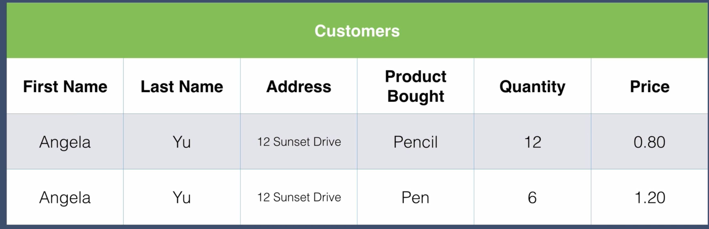
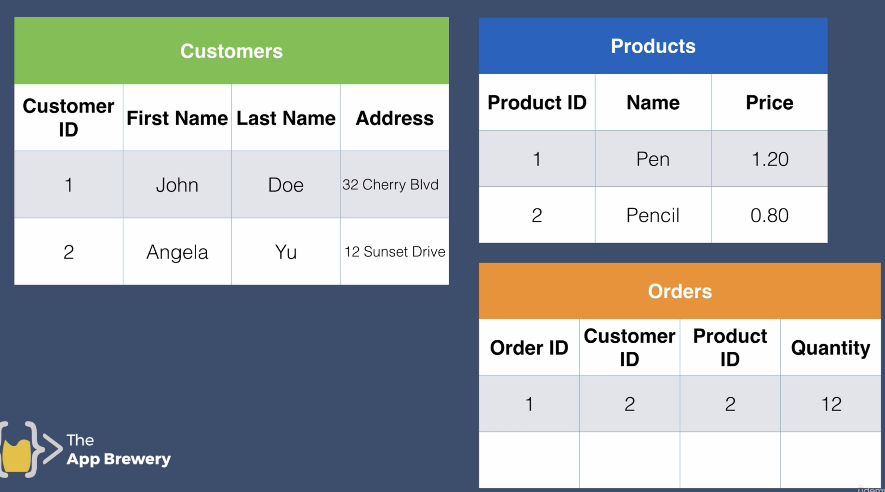

Notes on MongoDB 

# what is mongo db
> MongoDB is categorized as a "NoSQL" database

>"NoSQL" does not mean "no SQL" in the sense of not using any form of query language. Rather, it stands for "**Not Only SQL**" indicating that NoSQL databases do not exclusively rely on the traditional SQL-based relational model for data storage and retrieval.

> MongoDB uses a query language similar to SQL, called the MongoDB Query Language (MQL), to interact with its data and to persorf CRUD operations.

## SQL vs NoSQL database
> SQl is also called as relational and NoSQl can be referred as non-relational databases.

> The SQL database has the fixed schema(the schema is typically defined using tables, columns, data types, and relationships between tables) where as the NoSQL donot have fixed schema.

> lets understand with an example 
  --> Suppose I started a book store and I deliver books to the customers and my customer table contains name, address and mobile number.
	  If one of the customers want himself to be updated with the order details over email, we are supposed to add anoterh column meanwhile the another customer don't want to give his mobile number,

> IN the above scenarios if we use the SQL database the left over columsn with no data are filled with **null** which is a bit dangerous. 

> In the same scenario if we implant NoSQL it is not at all a problem as the data is represented in BSON. That particular customer contains an extra record that's it.

## Use cases of relational(SQL) and non relational(NoSQL) databases
> If we have to maintain multiple relationship between the tables **Ex:** If the customer buy 2-3 products at a time we don't store everything in the same table like in the image  instead we split the data accross multiple tables like in the next image 


## Swagger dependency

``` java
<dependency>
	<groupId>org.springdoc</groupId>
	<artifactId>springdoc-openapi-starter-webmvc-ui</artifactId>
	<version>2.0.0</version>
</dependency>
```

## The below line has to be added on the pojo class 
pojo is often referred as document because, a document in MongoDB is essentially a JSON-like structure that represents a piece of data.

In MongoDB, a collection is a grouping of MongoDB documents. It is the equivalent of a table in a relational database. Each collection
exists within a specific database and can hold a set of documents that represent related data.

``` java
@Document(collection = "JobPost");
```

To find the URI added in application.properties go to mongo atlas
login with mail id -> database-> under database click connect -> select drivers and URL will ge given
modify the URI having <password> with correct password(saikrishna).

> The hierarchy is as follows: within a MongoDB cluster, you can have multiple databases, each database can contain multiple collections, and each collection holds individual documents.

## Collection vs Document
> Collection is a group of mongoDB documents, It's analogous to a table in relational databases.

>A document is a basic unit of data in MongoDB. It's similar to a row in a relational database, but MongoDB documents are stored in a flexible, JSON-like format known as BSON (Binary JSON).
--> we can assume Collecation as a table and Document as a row in that table.
        